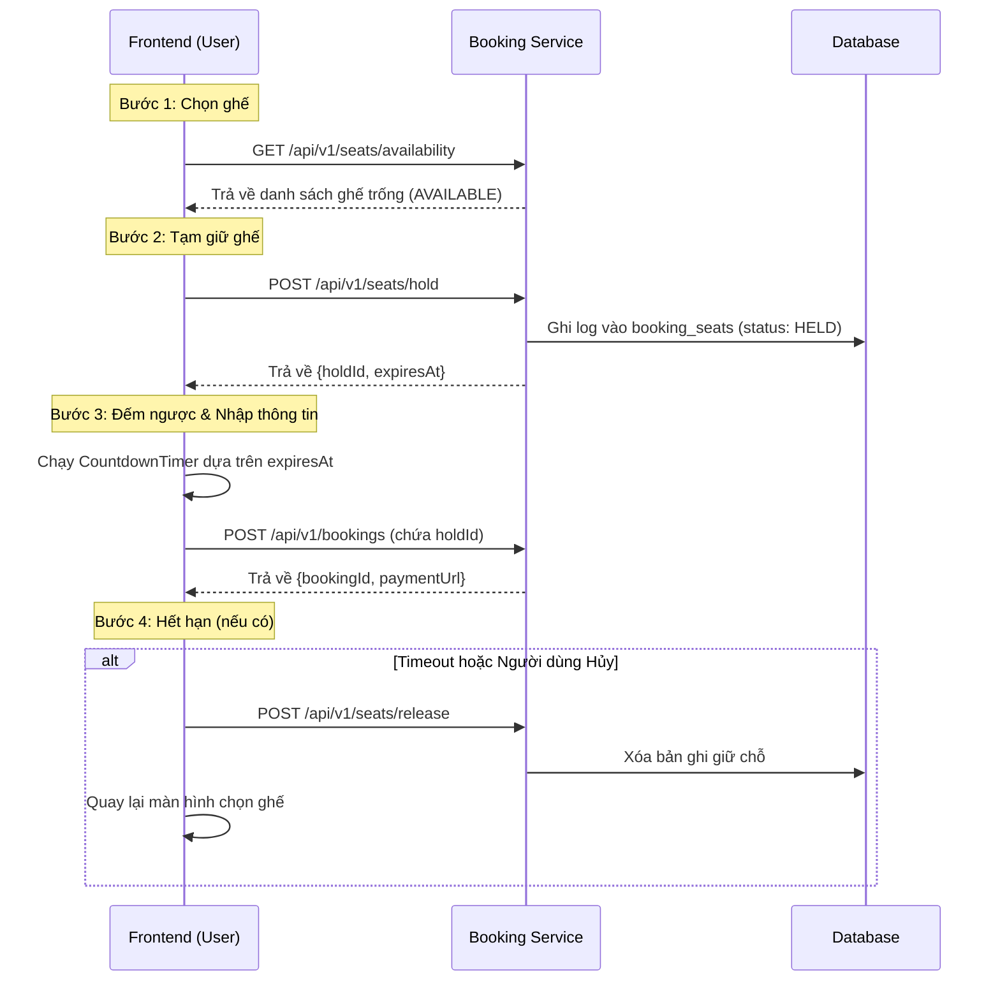

# Seat Holding & Countdown Integration Guide

Tài liệu này hướng dẫn cách tích hợp quy trình giữ chỗ (Seat Holding) từ bước chọn ghế đến khi thanh toán hoàn tất, đảm bảo đồng bộ giữa Frontend (FE) và Backend (BE).

## 1. Quy trình nghiệp vụ (Workflow)



---

## 2. Chi tiết API

### A. API Giữ chỗ (Hold Seats)
Sử dụng khi người dùng nhấn "Tiếp tục" sau khi chọn ghế.

- **Endpoint**: `POST /api/v1/seats/hold`
- **Auth**: `Required (Bearer Token)`
- **Request Body**:
  ```json
  {
    "routeId": "uuid-chuyen-xe",
    "departureDate": "2026-01-24",
    "seats": ["1A-L", "1B-L"],
    "ttlSeconds": 900 
  }
  ```
- **Response (Success)**:
  ```json
  {
    "success": true,
    "data": {
      "holdId": "d6ff844e-2020-46c0-bc57-bc4ae54d32d6",
      "expiresAt": "2026-01-26T08:03:16.940Z",
      "seats": ["1A-L", "1B-L"]
    }
  }
  ```

### B. API Giải phóng ghế (Release Seats)
Sử dụng khi đồng hồ đếm ngược về 0 hoặc người dùng nhấn nút "Hủy/Quay lại".

- **Endpoint**: `POST /api/v1/seats/release`
- **Auth**: `Required (Bearer Token)`
- **Request Body**:
  ```json
  {
    "holdId": "d6ff844e-2020-46c0-bc57-bc4ae54d32d6"
  }
  ```

---

## 3. Hướng dẫn tích hợp Frontend

### A. Xử lý logic Đếm ngược (Countdown)
Frontend sử dụng `expiresAt` (ISO string) để tính toán thời gian thực tế còn lại.
- **Màu sắc**: Khuyến khích đổi sang màu Đỏ khi thời gian còn dưới 60 giây.
- **Hành động**: Khi hết giờ, gọi API `release` và thông báo cho người dùng trước khi điều hướng về trang chọn ghế.

### B. Cơ chế tự động dọn dẹp (Backend Cleanup)
Backend đã tích hợp **Cron Job chạy mỗi 60 giây**. 
- Nếu người dùng tắt trình duyệt đột ngột (không gọi được API release), Backend sẽ tự động xóa các phiên giữ chỗ hết hạn.
- FE chỉ cần gọi lại API `availability` để cập nhật trạng thái ghế mới nhất.

### C. Case xử lý lỗi
- **Lỗi 400 (Validation)**: Kiểm tra lại format ghế (Định dạng chuẩn: `1A-L`, `2B-U`).
- **Lỗi 409 (Conflict)**: Ghế vừa bị người khác giữ. FE cần thông báo: "Ghế đã có người chọn" và refresh lại sơ đồ.

---

**Lưu ý**: Luôn gửi `holdId` kèm theo yêu cầu tạo Booking (`POST /api/v1/bookings`) để Backend xác nhận đúng phiên giữ chỗ.
